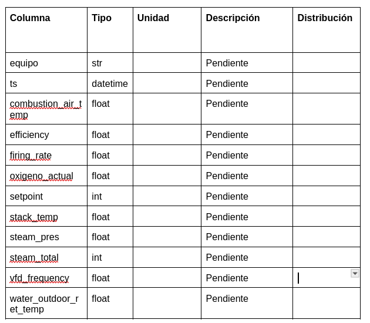
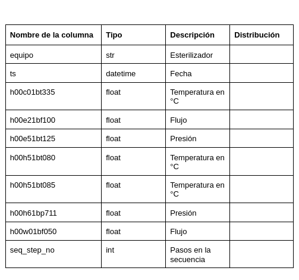
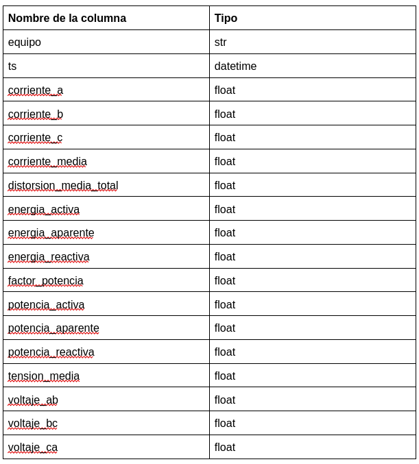
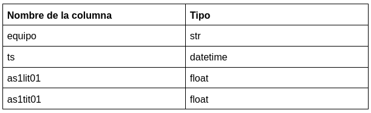
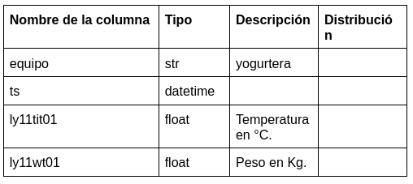

# Readme entregable 3

## Como ejecutar los scripts

1. Abra el siguiente enlace para cargar el notebook desde Google Colab:
[Collaboratory](https://colab.research.google.com/github/Causil/especializacion/blob/main/monografia/momentos_evaluativos/Momento%203/ME03-G10-%5B1038129159%5D-%5B98761437%5D.ipynb) 

2. Corra todo el Google Colab

## Exploration and Preparation

Descripción de la Actividad 1. 
Cada grupo deberá describir detalladamente los datos originales disponibles para su proyecto, incluyendo formatos, distribución de los datos, descripción de las columnas, y cualquier etiquetado disponible

El equipo desarrollador de Auralac, nos dio acceso a la nube mediante un usuario de AWS con ciertos privilegios, que nos permiten interactuar con la base de datos no relacional DynamoDB, se está tramitando un diccionario de datos en el cual se explique cada contexto de las variables, por el momento se tiene una relación de las tablas sobre las cuales se tiene acceso para el proyecto, en las cuales se identifica el tipo de colecciones y su relación con la planta de producción. Nos estamos preparando para utilizar el entorno de Glue.

Se dispone de dos fuentes de datos:
1. Información de la energía activa y reactiva por hora para el periodo comprendido entre febrero de 2020 y mayo de 2023. Estos datos son proporcionados directamente por la empresa prestadora de servicios de energía eléctrica y son un instrumento para el control del pago de la facturación mensual. Se cuenta con un archivo en excel por año. Cada archivo contiene cuatro variables de las cuales se tiene información para cada hora:
    - Energía Activa Consumo (kWh)
    - Energía Activa Generación (kWh)
    - Energía Reactiva Inductiva (kVarh)
    - Energía Reactiva Capacitiva (kVarh)

Preparación de los datos:

1.1. Debido a que los archivos de cada año se encuentran en excel, es necesario extraer la información de cada uno de ellos para consolidar una tabla global que consolide la información de todos los años. Se hace necesario identificar las celdas que contienen información y eliminar columnas con valores nulos.

1.2. Con la información de las tablas se hace necesario consolidar para cada variable la información disponible en horas y sumar los valores correspondientes para tener la información completa por día.

Mediciones de los sensores de equipos de la empresa productora de lácteos. Los sensores toman los datos por segundo de ciertas métricas asociadas al estado de los equipos para el seguimiento en la producción, los cuales son almacenados en la nube a través del servicio de AWS. Actualmente el acceso a las bases de datos se encuentran limitadas por parte de la oficina de TI, por lo cual sólo se tienen datos muestra muestra para el ejercicio. Una vez se restablezca el servicio, se procederá a realizar el análisis correspondiente con la totalidad de los datos disponibles. Se está a la espera de la entrega del diccionario de datos generados por los sensores por parte del equipo de TI.

- auralac_iot_calderas: Esta colección se encarga de almacenar la información que los sensores captan de la pasteurización a través de vapor. 

- auralac_iot_esterilizadores: Está colección se encarga de almacenar los datos de la pasteurización de la leche.

- auralac_iot_power_meters: Almacena la información de la energía de los equipos utilizados para abastecer la planta, en está colección se encuentra el histórico de la energía reactiva.

- auralac_iot_silos: La colección almacena las variables que alojan la cantidad de leche por silo y la temperatura a la que se encuentra.

- auralac_iot_yogurteras: Contiene las variables que describen el peso que tiene el equipo y su temperatura.

